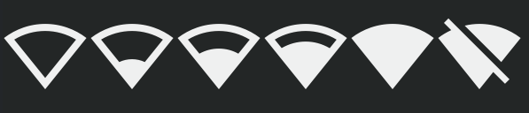
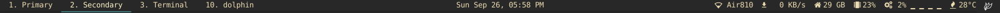

# polybar-wifi-ramp-icons






A patched "DejaVu Sans Mono" font that includes the wifi icons to be used in polybar network ramp-signal.

I have added added icons which shows different level of wifi strength in the DejaVuSansMono font.
Note it is not ["DejaVuSansMono Nerd Font"](https://github.com/ryanoasis/nerd-fonts/releases/download/v2.1.0/DejaVuSansMono.zip), so you need to add atleast one of the [nerd font](https://www.nerdfonts.com/) if you want to see other beautiful icons.

I tried searching for fonts which had these icons but couldn't find one, so I decided to create it own my own.

## How to donwload?

### Using git

#### HTTPS
`https://github.com/isaif/polybar-wifi-ramp-icons.git`

#### SSH
`git@github.com:isaif/polybar-wifi-ramp-icons.git`

### Downloading it as a zip
Paste the below link in your browser to download it.

`https://github.com/isaif/polybar-wifi-ramp-icons/archive/refs/heads/main.zip`

### Using curl
`curl https://github.com/isaif/polybar-wifi-ramp-icons/archive/refs/heads/main.zip`


## How to install?
If you have downloaded it as a zip then you first need to unzip it.

### Windows
Right click the font file "DejaVuSansMono-wifi-ramp.ttf" and click on install.

### Linux
Copy `DejaVuSansMono-wifi-ramp.ttf` to `~/.fonts`, or

1. Create a new directory in ~/.local/share
`$ mkdir ~/.local/share/fonts`
2. Regenerate your fonts
`$ fc-cache -f -v`
3. Verify the installation  
  `fc-list | grep -i "wifi"`

    You may get an output similar to this  
    `/home/saif/.fonts/polybar/DejaVuSansMono-wifi-ramp.ttf: DejaVu Sans Mono wifi ramp:style=wifi-ramp`  
    Just ensure that `DejaVuSansMono-wifi-ramp.ttf` is in the output


## Usage

1. First download and install the font.
2. Add it to your config. See the config below to get the idea.
    
## Polybar config

```

font-0 =  DejaVuSansMono Nerd Font:size=9
font-1 = DejaVu Sans Mono wifi ramp:size=10

[module/network]
type = internal/network
interface =  wlp0s26u1u4

interval = 1.0
accumulate-stats = true
unknown-as-up = true

label-connected = %essid%  %downspeed:9%
label-disconnected = 

format-connected = <ramp-signal> <label-connected>
format-disconnected = <label-disconnected>

ramp-signal-0 = 
ramp-signal-1 = 
ramp-signal-2 = 
ramp-signal-3 = 
ramp-signal-4 = 
ramp-signal-5 = 
```

`font-0` can be any font you want, I have shown it here just for example.
Change the `interface` to the one you have.


## How I made it?

I used the "DejaVu Sans Mono" font in [fontforge](https://www.nerdfonts.com/) to add icons.
I created svg for each icons and added it to private usage area of the font by importing it.
The private usage area were not being used in either "DejaVu Sans Mono" or "DejaVu Sans Mono Nerd Font" so there won't be any conflicts.
I saved it as a new font "DejaVu Sans Mono wifi ramp".
Later I intend to add the icons to "DejaVu Sans Mono Nerd Font" so only one font can have all the icons.

I spent few days researching and creating this project as there were quite a few methods to accomplish it.
Each method had its own pros and cons. Finally I settled on doing this on fontforge.
If you found this helpful consider giving a star to the repository.

